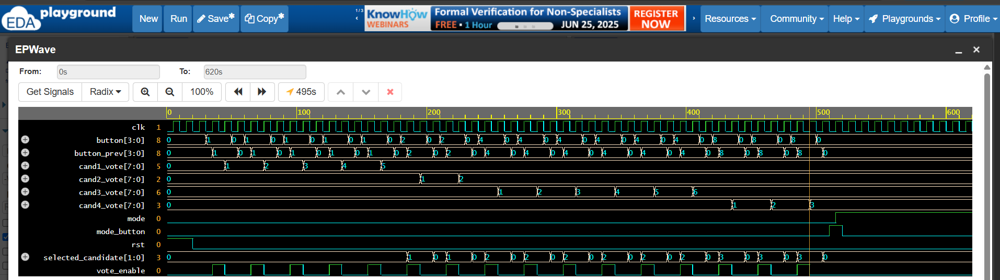

# Verilog Voting Machine 🗳️

A fully functional **2-mode digital voting machine** designed in **Verilog**, simulated using **EPWave** on EDA Playground.

---

## 🎯 Features

- ✅ Mode 0: **Voting Mode** – Logs votes via button press (rising edge only)
- ✅ Mode 1: **Tally Mode** – Vote count is frozen and displayed
- ✅ Edge detection logic – ensures accurate one-vote-per-press
- ✅ Clean modular design with:
  - `button_control`
  - `mode_control`
  - `vote_logger`
  - `voting_machine` (top module)
- ✅ Tested with exact input to produce:
  - Candidate 1: `5 votes`
  - Candidate 2: `2 votes`
  - Candidate 3: `6 votes`
  - Candidate 4: `3 votes`

---

## 📷 Simulation Result (Waveform Screenshot)

---

## 📂 Files

| File           | Description                              |
|----------------|------------------------------------------|
| `design.sv`    | All Verilog modules in a single file     |
| `testbench.sv` | Stimulus to test voting + tally behavior |
| `waveform.png` | Screenshot of simulation result          |

---

## 🛠️ Tools Used

- **EDA Playground**
- **Verilog (IEEE 1364-2001/2012)**
- **EPWave GTKWave Viewer**

---

📍 Project uploaded on GitHub for public reference  
